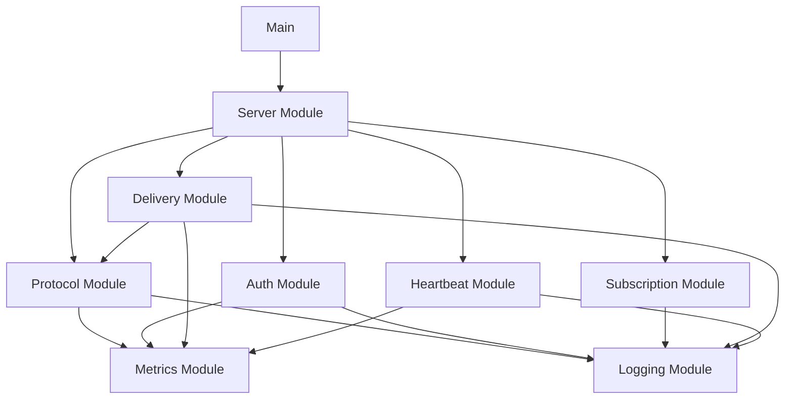

# Tick-Storm Architecture Design Document

## High-Level Architecture

```
┌─────────────┐     ┌─────────────────┐     ┌──────────────────┐
│   Clients   │────▶│  L4 TCP Load    │────▶│  Tick-Storm      │
│  (100k+)    │     │    Balancer     │     │  Server Pool     │
└─────────────┘     └─────────────────┘     └──────────────────┘
                           │                         │
                           │                    ┌────┴────┐
                           │                    │ Server1 │
                           │                    ├─────────┤
                           └───────────────────▶│ Server2 │
                                                ├─────────┤
                                                │ ServerN │
                                                └─────────┘
```

## System Components

### 1. L4 TCP Load Balancer
- **Type:** Layer 4 (TCP) load balancing
- **Algorithm:** Least connections or round-robin
- **Health Checks:** TCP connection test on port 8080
- **Session Persistence:** Not required (stateless servers)
- **Configuration:**
  ```yaml
  backend:
    - server1:8080
    - server2:8080
    - serverN:8080
  health_check:
    interval: 5s
    timeout: 2s
    unhealthy_threshold: 3
  ```

### 2. Tick-Storm Server Instances
- **Deployment:** Stateless, horizontally scalable
- **Concurrency Model:** Goroutine-per-connection
- **Resource Limits:** 
  - Max connections: 100k per instance
  - Memory: < 1GB per instance
  - CPU: < 70% utilization at peak

## Internal Module Architecture

```
┌──────────────────────────────────────────────────────┐
│                   Tick-Storm Server                   │
├──────────────────────────────────────────────────────┤
│                    Main Entry Point                   │
├──────────────────────────────────────────────────────┤
│  ┌──────────┐  ┌──────────┐  ┌──────────────────┐   │
│  │  Server  │  │ Protocol │  │  Authentication  │   │
│  │  Module  │  │  Module  │  │     Module       │   │
│  └──────────┘  └──────────┘  └──────────────────┘   │
│  ┌──────────┐  ┌──────────┐  ┌──────────────────┐   │
│  │Subscription│ │ Delivery │  │    Heartbeat     │   │
│  │  Module  │  │  Module  │  │     Module       │   │
│  └──────────┘  └──────────┘  └──────────────────┘   │
│  ┌──────────┐  ┌──────────┐                         │
│  │ Metrics  │  │ Logging  │                         │
│  │  Module  │  │  Module  │                         │
│  └──────────┘  └──────────┘                         │
└──────────────────────────────────────────────────────┘
```

## Module Specifications

### Server Module (`internal/server`)
**Responsibility:** TCP connection management and lifecycle
```go
type Server interface {
    Start(ctx context.Context) error
    Stop(ctx context.Context) error
    HandleConnection(conn net.Conn)
}
```
- TCP listener management
- Connection acceptance loop
- Graceful shutdown
- Connection pooling

### Protocol Module (`internal/protocol`)
**Responsibility:** Binary framing and message parsing
```go
type Protocol interface {
    ReadFrame(conn io.Reader) (*Frame, error)
    WriteFrame(conn io.Writer, frame *Frame) error
    Marshal(msg proto.Message) ([]byte, error)
    Unmarshal(data []byte, msg proto.Message) error
}
```
- Frame structure: `[Magic][Ver][Type][Len][Payload][CRC32C]`
- CRC32C checksum validation
- Protobuf serialization/deserialization
- Frame size validation (MAX_MSG_SIZE)

### Authentication Module (`internal/auth`)
**Responsibility:** Client authentication and credential validation
```go
type Authenticator interface {
    Authenticate(username, password string) error
    ValidateToken(token string) error
    RateLimitCheck(clientIP string) error
}
```
- Environment variable credential storage
- Rate limiting (10 attempts/minute per IP)
- Authentication state management
- Failed attempt tracking

### Subscription Module (`internal/subscription`)
**Responsibility:** Manage client subscription modes
```go
type SubscriptionManager interface {
    Subscribe(clientID string, mode Mode) error
    Unsubscribe(clientID string) error
    GetSubscription(clientID string) (*Subscription, error)
}
```
- Mode management (SECOND/MINUTE)
- Subscription state tracking
- Mode change handling
- Subscription validation

### Delivery Module (`internal/delivery`)
**Responsibility:** Tick generation and batching
```go
type Delivery interface {
    StartDelivery(ctx context.Context, sub *Subscription) error
    StopDelivery(clientID string) error
    SendBatch(conn net.Conn, batch *DataBatch) error
}
```
- Tick generation based on mode
- Micro-batching (5ms window)
- Write queue management
- Backpressure handling
- Write deadline enforcement

### Heartbeat Module (`internal/heartbeat`)
**Responsibility:** Connection health monitoring
```go
type HeartbeatMonitor interface {
    StartMonitoring(conn net.Conn) error
    HandleHeartbeat(clientID string) error
    CheckTimeout(clientID string) bool
}
```
- Heartbeat interval: 15s
- Timeout threshold: 20s
- Connection termination on timeout
- Heartbeat acknowledgment

### Metrics Module (`internal/metrics`)
**Responsibility:** Prometheus metrics collection
```go
type MetricsCollector interface {
    RecordConnection(action string)
    RecordMessage(msgType string, size int)
    RecordLatency(operation string, duration time.Duration)
}
```
Metrics:
- `tickstorm_active_connections` (gauge)
- `tickstorm_messages_sent_total` (counter)
- `tickstorm_bytes_sent_total` (counter)
- `tickstorm_heartbeat_timeouts_total` (counter)
- `tickstorm_publish_latency_ms` (histogram)

### Logging Module (`internal/logging`)
**Responsibility:** Structured JSON logging
```go
type Logger interface {
    Info(msg string, fields ...Field)
    Error(msg string, err error, fields ...Field)
    Debug(msg string, fields ...Field)
}
```
- JSON format output
- Log level configuration
- Context propagation
- Request ID tracking

## Module Dependencies



## Scalability Considerations

### Horizontal Scaling
- Stateless server design enables linear scaling
- No shared state between server instances
- Client connections distributed by load balancer
- Target: 100k connections per server instance

### Performance Optimizations
- Connection pooling with sync.Pool
- Buffer reuse for frame processing
- Goroutine-per-connection with controlled spawning
- TCP_NODELAY for low latency
- Write buffering with configurable flush intervals

### Resource Management
- Connection limits per instance
- Memory bounds with buffer pools
- CPU throttling via GOMAXPROCS
- File descriptor limits (ulimit)

## Deployment Architecture

### Container Deployment
```dockerfile
FROM gcr.io/distroless/static:nonroot
COPY tick-storm /
USER nonroot:nonroot
EXPOSE 8080
ENTRYPOINT ["/tick-storm"]
```

### Kubernetes Deployment
```yaml
apiVersion: apps/v1
kind: Deployment
metadata:
  name: tick-storm
spec:
  replicas: 3
  selector:
    matchLabels:
      app: tick-storm
  template:
    metadata:
      labels:
        app: tick-storm
    spec:
      containers:
      - name: tick-storm
        image: tick-storm:latest
        ports:
        - containerPort: 8080
        resources:
          requests:
            memory: "512Mi"
            cpu: "500m"
          limits:
            memory: "1Gi"
            cpu: "1000m"
        env:
        - name: STREAM_USER
          valueFrom:
            secretKeyRef:
              name: tick-storm-secrets
              key: username
        - name: STREAM_PASS
          valueFrom:
            secretKeyRef:
              name: tick-storm-secrets
              key: password
```

## Architecture Decisions Record (ADR)

### ADR-001: Goroutine-per-connection Model
**Status:** Accepted  
**Context:** Need to handle 100k+ concurrent connections  
**Decision:** Use goroutine-per-connection for simplicity  
**Consequences:** Higher memory usage but simpler code  

### ADR-002: Stateless Server Design
**Status:** Accepted  
**Context:** Need horizontal scalability  
**Decision:** No shared state between connections  
**Consequences:** Easy scaling, no session affinity needed  

### ADR-003: Binary Protocol with Protobuf
**Status:** Accepted  
**Context:** Need low latency and efficient serialization  
**Decision:** Custom binary framing with Protobuf payloads  
**Consequences:** Lower overhead than text protocols  

### ADR-004: Micro-batching Strategy
**Status:** Accepted  
**Context:** Balance between latency and throughput  
**Decision:** 5ms batching window by default  
**Consequences:** Reduced per-message overhead  

## Security Architecture

### Network Security
- TLS 1.3 for encrypted transport (optional)
- mTLS for mutual authentication (optional)
- Rate limiting on authentication attempts
- Connection throttling per IP

### Application Security
- Environment variable credential storage
- No hardcoded secrets
- Input validation on all frames
- CRC32C integrity checking

## Monitoring & Observability

### Health Checks
- TCP connection test endpoint
- Liveness: `/health/live`
- Readiness: `/health/ready`

### Metrics Endpoint
- Prometheus metrics: `/metrics`
- Custom business metrics
- System resource metrics

### Distributed Tracing
- Optional OpenTelemetry integration
- Trace ID propagation
- Span creation for key operations

---

**Approval Status:** ✅ APPROVED  
**Approved By:** Technical Architecture Team  
**Date:** 2025-08-09  
**Version:** 1.0
